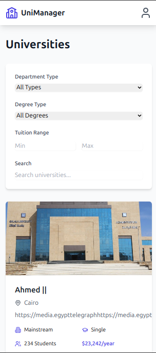
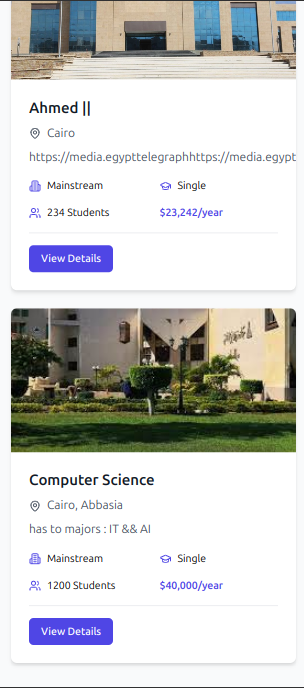
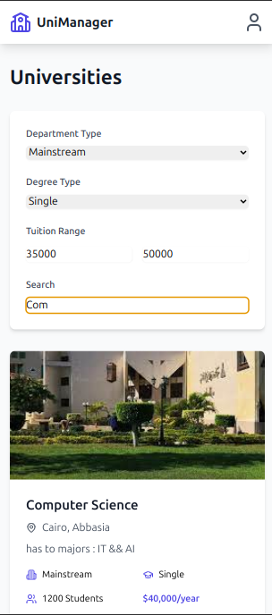
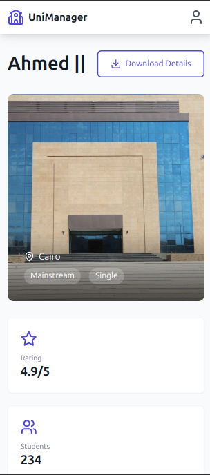
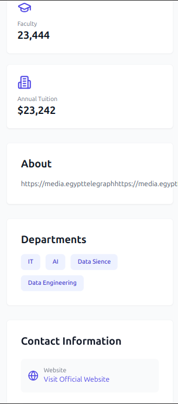

# 🎓 Egyptian Universities Management System


## 📌 Overview
The **Egyptian Universities Management System** is a comprehensive platform designed to manage university, faculty, and department data, specifically tailored to help high school students choose the right academic path based on multiple criteria.

## 🎯 Main Objective
Providing an intelligent tool that enables students to:
- ✅ Easily compare universities and faculties
- ✅ Apply advanced filtering based on disciplines, degrees, tuition fees, and more
- ✅ Export results as a **PDF** for future reference or sharing with parents and advisors
- ✅ **Fully responsive** for seamless experience across all devices (Desktop, Tablet, Mobile)

---
## ✨ Key Features

### 1️⃣ Advanced Filtering System (High-Precision Filtering)
A powerful filtering system allowing students to find the most suitable academic programs with precision:

🔍 **Filter by Department Type** (Engineering, Medicine, Business, Arts, etc.)

🎓 **Filter by Degree Type** (Bachelor’s, Master’s, Ph.D.)

💰 **Filter by Tuition Fee Range** (Set minimum and maximum tuition costs)

🔎 **Smart Search** (Search by name or keywords)

### 2️⃣ Export Results to PDF
📄 **Convert search results into a well-structured and clean PDF** including:
- University & faculty name
- Available disciplines
- Tuition fees
- Admission requirements
- 🖨️ **Print or save for later review**

### 3️⃣ Fully Responsive & Modern UI
📱 **Adaptive layout** that works seamlessly across desktop, tablet, and mobile devices.
🎨 **Clean and intuitive design** powered by TailwindCSS.

---
## 🛠 Tech Stack
| Feature | Technologies |
|----------|------------|
| **Frontend** | React.js + TailwindCSS |
| **Backend** | Node.js + Express |
| **Database** | MongoDB (NoSQL) |
| **PDF Generation** | html2pdf.js |
| **State Management** | React Query + React Hook Form |

---
## 🖼️ Screenshots
### 🔹 Homepage
(./assets/home2.png)
(./assets/home2.png)


### 🔹 Advanced Filters


### 🔹 PDF Export



*More screenshots available in the project repository.*

---
## 🚀 How It Works (Example Usage)
1. Select **"Engineering Faculty"** from the **Department Type** filter.
2. Choose **"Bachelor's Degree"** from the **Degree Type** filter.
3. Set tuition range between **10,000 and 50,000 EGP**.
4. Click **Search** to display matching results.
5. Export the results as **PDF** for sharing or printing.

---
## 📥 How to Run Locally
Clone the repository and run the project locally:

```bash
# Clone the project
git clone https://github.com/ahmed-838/Egypt-Universities-Dashboard.git

# Navigate to the directory
cd Egypt-Universities-Dashboard

# Install dependencies
npm install

# Start the project
npm run dev
```
---
## 🎯 Why This Project Stands Out?
- ✅ **User-friendly interface for non-tech-savvy students**
- ✅ **Highly accurate search and filtering results**
- ✅ **Saves time when comparing university options**
- ✅ **Export functionality for well-informed decision-making**
- ✅ **Fully responsive for all devices**

---
## 🤝 Contribute to the Project!
We welcome contributions! Feel free to open an **Issue** or submit a **Pull Request** on [GitHub](https://github.com/ahmed-838/Egypt-Universities-Dashboard.git). 🚀
